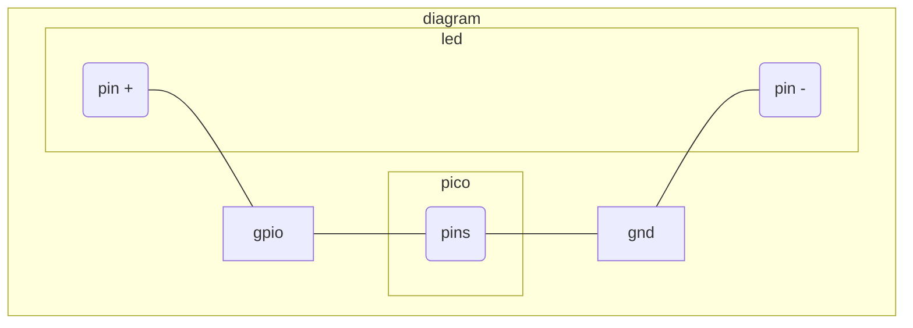

# blink

simple program that uses the build-in led on `pin 25` on the pi pico

## no build-in led?

no problem, all you have to do is change the ledPin to a gpio pin.
connect that gpio pin to the led through a resistor and finally to ground.

## To Do

- split pico and pico_w code for this dir
