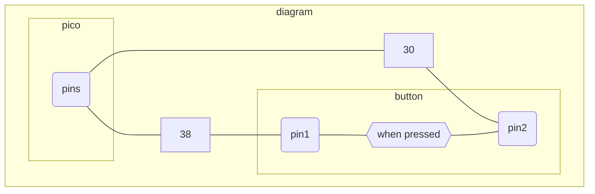

# Pico-Projects

repo containing my personal pico projects

## quick reset button

connect pin 38 (GND) with pin 30 (RUN) via a button

```mermaid
flowchart TB
    subgraph diagram
        direction LR

        subgraph pico
            pins(pins)
        end

        subgraph button
            pin1(pin1)
            pin2(pin2)
            press{{when pressed}}
        end

        pins --- 30 ---pin2
        pins --- 38 ---pin1
        pin1 --- press --- pin2
    end

```
